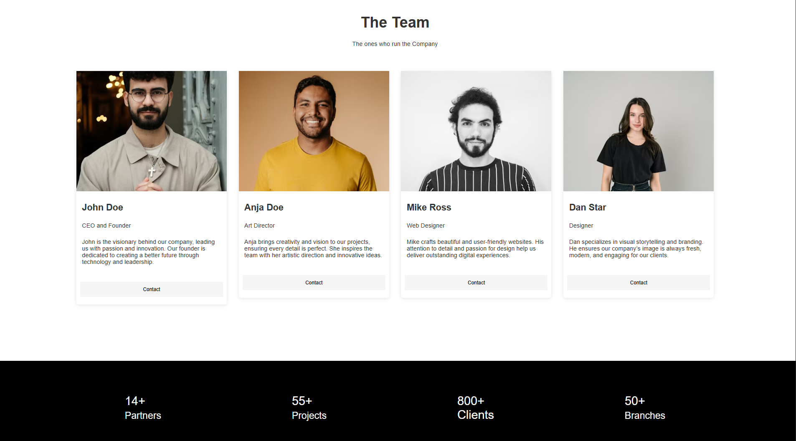

# Team Section UI

This project is a modern, responsive team section for a company website. It features a clean layout with individual team member cards, each displaying a photo, name, position, and a short description, along with a contact button. Below the team section, there is a stats area highlighting company achievements.

## Features
- Responsive design: looks great on desktop and mobile
- Flexbox layout for easy alignment and wrapping
- Card-based design with subtle shadows and rounded corners
- Each card includes:
  - Team member photo
  - Name
  - Position
  - Short description
  - Contact button
- Company stats section with key metrics

## How to Use
1. Clone or download this repository.
2. Open `index.html` in your browser to view the UI.
3. Customize the team member details and images in `index.html` as needed.
4. Adjust styles in `style.css` for further customization.

## File Structure
- `index.html` – Main HTML file containing the team section and stats area
- `style.css` – CSS file for all layout and styling
- `README.md` – Project overview and usage instructions

## Customization
- Replace the image URLs in the HTML with your own team member photos.
- Edit the names, positions, and descriptions to match your team.
- Adjust the color scheme and spacing in `style.css` to fit your brand.

## Preview

---

This UI is ideal for company websites, portfolios, or any project that needs a clean and modern team showcase.
